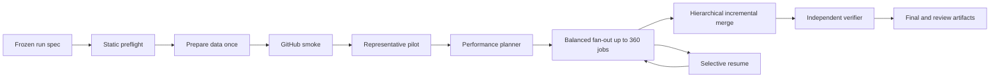

# Aurora GitHub Performance System

Date: 2026-07-25

Status: internally reviewed and approved after repository compatibility audit

## 1. Purpose

Aurora needs a mandatory execution system for future research workflows that:

- runs heavy work only in GitHub Actions;
- uses at most the 360 standard concurrent jobs confirmed for the organization;
- minimizes wall-clock time first and billable minutes second;
- preserves every scientific, causal, locked, validation, provenance, and
  reconciliation invariant;
- can resume without repeating successful work;
- improves workflow orchestration first, adds a universal performance planner
  second, and introduces native kernels only for measured hot paths third.

The system and the master run template will both be delivered. The template is
the policy contract; the implementation enforces it.

## 2. Scope

This system is mandatory for future workflows only.

Existing workflows are grandfathered and will not be mass-edited. If an old
workflow is reused for a new campaign, that campaign must either:

1. migrate to the new framework; or
2. declare a temporary exception with an expiry date and explicit evidence.

Heavy local runs, local backtests, local smoke tests, and local performance
benchmarks remain prohibited unless the user explicitly authorizes that exact
local execution in the same turn.

## 3. Non-goals

- Rewriting all of Aurora.
- Migrating historical workflows automatically.
- Using paid larger runners.
- Changing strategies, metrics, dates, filters, or selection to improve speed.
- Dropping candidates, censored rows, unsupported rows, or failures silently.
- Using validation or locked data to tune execution or scientific decisions.
- Treating cache as durable scientific storage.

## 4. Fixed decisions

| Decision | Value |
|---|---|
| Execution location | GitHub Actions only |
| Standard concurrency reference | 360 jobs |
| Matrix maximum | 256 jobs |
| Default split at full capacity | 256 + 104 |
| Primary objective | Minimum wall-clock time |
| Secondary objective | Minimum billable minutes |
| Larger runners | Prohibited |
| Existing workflows | Grandfathered |
| Future workflows | Framework mandatory |
| Heavy local validation | Prohibited |
| Repository at design time | Public, Enterprise organization |
| Standard Linux runner at design time | 4 vCPU, 16 GB RAM, 14 GB SSD |

The value 360 is support-confirmed for this organization. GitHub does not expose
a dependable per-campaign API for the currently free portion of standard-runner
concurrency. Therefore preflight validates against a versioned
`capacity_profile.json`; the run records observed concurrency and flags drift.
A separate explicit capacity probe updates that profile when support or account
settings change. Production campaigns do not launch 360 empty probe jobs merely
to rediscover the same limit.

It is a ceiling, not a target that must always be filled. The planner chooses
fewer jobs whenever startup, queue, transfer, artifact, or merge overhead would
make 360 jobs slower.

The organization limit is shared. Aurora can request up to its configured
ceiling, but it cannot guarantee that every slot is immediately available while
other workflows are running. Queue delay is measured separately from execution
time and is never misreported as compute time.

## 5. System architecture



The scientific run spec is immutable. The performance plan may choose only
operational details explicitly allowed by this design.

## 6. Shared contracts

### 6.1 Scientific contract

The system receives a frozen spec defining:

- data snapshot;
- periods;
- universe;
- features;
- candidate space;
- metrics;
- costs;
- selection policy;
- causal timing;
- locked policy;
- validation policy;
- expected units and terminal states.

### 6.2 Work unit contract

Each logical unit has a stable `unit_key`. Every physical attempt has a distinct
`attempt_id`.

Terminal states are:

- `completed`;
- `right_censored`;
- `unsupported`;
- `failed_technical`.

The terminal-state sum must reconcile exactly to expected units.

### 6.3 Performance contract

The performance contract freezes:

- optimization objective;
- confirmed and reserved concurrency;
- runner contract;
- target setup/checkpoint fractions;
- shard balancing policy;
- allowed engines;
- compression policy;
- checkpoint margin;
- merge policy;
- adaptation boundaries.

The contract also defines hard resource budgets:

- maximum job count and matrix size;
- maximum API, cache, and artifact operations;
- maximum input and output bytes per shard;
- maximum memory and temporary-disk utilization;
- maximum retry attempts;
- artifact retention;
- benchmark method and minimum material improvement.

### 6.4 Identity and schema contract

Every run, plan, shard, attempt, dataset, intermediate, and final output carries:

- schema version;
- run-spec hash;
- code SHA;
- dependency-lock hash;
- data-snapshot hash;
- policy hash;
- capacity-profile hash;
- runner label, image OS, image version, architecture, CPU, RAM, and disk;
- logical `unit_key`;
- physical `attempt_id` where applicable.

Human-readable names are labels only. Reuse, reconciliation, and resume decisions
use stable hashes and logical keys.

### 6.5 Storage and transport contract

Storage has four explicit roles:

1. source snapshots: immutable scientific inputs;
2. content-addressed intermediates: verified reusable calculations;
3. checkpoints: resumable execution state;
4. final artifacts: auditable reader outputs.

GitHub cache is an acceleration layer, never the only copy of scientific state.
Every restored object is hash-verified. Cache misses change runtime only, not
results. Large manifests are transported as files or artifacts rather than job
outputs.

### 6.6 Aurora integration contract

The performance system extends existing Aurora primitives instead of creating
parallel replacements:

- `ProtocolPolicy` remains the source of `policy_hash`;
- `SnapshotStore` and `SnapshotBackend` remain the immutable data contract;
- `FeatureStore` remains the point-in-time feature contract;
- `WitnessRecorder` remains the input/output provenance record;
- `ExperimentTracker` remains the research lineage source where applicable;
- `monitoring.telemetry` remains the generic telemetry surface;
- `runtime_paths` remains the only runtime-path resolver.

Performance-specific schemas and aggregations may wrap these components, but
must not redefine their scientific identity or persistence semantics.

## 7. Phase 1: workflow efficiency foundation

### 7.1 Goal

Make every future workflow use one reliable and efficient GitHub execution
spine without requiring each campaign author to rebuild orchestration.

### 7.2 Workflow stages

1. `validate`
2. `prepare_data`
3. `smoke`
4. `pilot`
5. `plan`
6. `fanout_a`
7. `fanout_b`
8. optional hierarchical merge levels
9. `final_merge`
10. `verify`
11. `publish`

`fanout_a` and `fanout_b` are generated from the manifest. At full confirmed
capacity they contain 256 and 104 jobs.

For 256 or fewer planned jobs, only one non-empty matrix is emitted. Empty
matrices are never submitted. Every matrix uses `fail-fast: false`; downstream
reconciliation and salvage jobs run with `if: always()` so one failed shard does
not discard valid siblings.

Heavy future workflows are manual or reusable (`workflow_dispatch` and/or
`workflow_call`) by default. They do not run 360-job campaigns automatically on
ordinary pushes or pull requests. Lightweight static enforcement remains
automatic.

### 7.3 Data preparation

Data and common features are prepared once. A shard downloads only its required:

- partitions;
- columns;
- symbols;
- dates;
- shared feature blocks.

Immutable datasets live outside shard artifacts. Artifacts contain results,
manifests, telemetry, and errors.

Preparation writes a partition manifest with sizes, row counts, date ranges,
schema hashes, and checksums. Shards use predicate and column projection and
never download an entire lake when they need a small subset.

GitHub artifact downloads are artifact-granular, not byte-range or
file-selective. The transport plan therefore chooses explicitly:

- small input: one immutable input artifact;
- medium input: a bounded number of coarse partition artifacts, each containing
  several files;
- large input: an already configured immutable `SnapshotBackend` or external
  object store with partition/range access.

Aurora never claims selective partition downloads from one monolithic Actions
artifact. Remote object storage is optional and cannot be assumed configured.
When it is unavailable, the planner must choose a viable artifact layout or
block before fan-out.

### 7.4 Environment startup

The pilot compares approved startup options:

- locked dependency installation;
- dependency cache;
- prebuilt wheelhouse;
- approved container.

The selected option must preserve exact versions and have the shortest measured
critical path. One job writes each cache key; fan-out jobs restore only.

Checkout is shallow and sparse when the workload allows it. Repositories,
wheelhouses, and containers are never rebuilt independently by every shard.

The runtime setup pins numerical-library thread counts to detected runner CPUs.
Nested process pools and BLAS/OpenMP oversubscription are prohibited. A job may
use processes or threads only within its measured CPU and memory budget.

The public-repository baseline is currently 4 vCPU, 16 GB RAM, and 14 GB SSD on
standard Ubuntu runners. These values are detected and recorded at runtime,
never treated as permanent constants. The workflow pins a stable Ubuntu label
rather than `ubuntu-latest`, and records GitHub runner image metadata because
the hosted image itself can still change.

### 7.5 Static shard balancing

Phase 1 supports deterministic weighted bundles using user-supplied or
pilot-measured unit costs. It applies longest-processing-time-first allocation
and emits `balanced_shard_plan.json`.

The planner estimates the useful job count before fan-out. Its model includes:

```text
predicted_wall_time =
    queue_and_startup
  + slowest_balanced_shard
  + data_transfer
  + checkpoint_and_upload
  + hierarchical_merge
  + verification
```

It evaluates feasible job counts from 1 through the confirmed ceiling and
selects the lowest predicted critical path. A job is not created when its
expected useful compute is too small relative to setup and transfer overhead.

Unknown workloads use a representative pilot. Highly skewed workloads use
cost classes and deterministic heavy/light mixing. A single oversized unit is
split only when the scientific work-unit contract explicitly supports it.

### 7.6 Data formats and compression

- Scientific tables: Parquet.
- Variable records: compressed JSONL.
- Human summaries: CSV.
- Precompressed data: artifact compression level 0.
- Large text: initial compression level 1.
- Higher compression: pilot evidence required.
- Large CSV intermediates: prohibited by default.

Row groups and partitions are sized from pilot measurements. Serialization is
streamed and bounded; a shard does not retain all results in memory merely to
write one final file.

Artifacts are bundled at shard or merge-partition level. One artifact per tiny
unit is prohibited because API calls, file counts, and upload startup would
dominate runtime. Artifact names include run, shard, attempt, and schema identity
so retries cannot overwrite or masquerade as prior attempts.

### 7.7 Checkpoints

Each shard:

- checkpoints by completed unit range;
- reserves shutdown margin;
- writes an atomic manifest;
- uploads before timeout;
- resumes from the first unconfirmed unit.

Checkpoint overhead must remain below the configured target.

Checkpoint frequency is selected from measured unit duration, remaining timeout,
and upload cost. A final `if: always()` salvage step uploads the last valid
atomic checkpoint and technical diagnostics even after normal execution fails.

### 7.8 Hierarchical merge

The pilot produces a merge plan. Large campaigns use parallel partial merges so
the final runner does not need every source shard simultaneously.

Partial merges are immutable, hashed, idempotent, and reusable by `merge-only`.

Merge fan-in is chosen to stay below memory, disk, artifact-download, and API
budgets. Reads use projection and streaming aggregation. The final merge rejects
duplicate logical units, conflicting attempts, schema drift, and unexplained
missing units.

### 7.9 Telemetry

Every job records:

- queue;
- provisioning;
- checkout;
- environment setup;
- data download;
- compute;
- serialization;
- compression;
- upload;
- merge;
- verification;
- units processed;
- bytes;
- CPU;
- memory;
- disk;
- I/O wait.

Telemetry records both p50 and tail behavior by shard and separates queue time
from runner time. It contains no secrets and no scientific result values used
for selection.

The final report includes:

- requested, observed, and peak parallelism;
- useful compute fraction;
- setup and transfer fraction;
- straggler gap;
- cache hit and verified-restore rates;
- checkpoint overhead;
- retry waste;
- merge critical path;
- predicted versus observed wall time;
- billable minutes.

### 7.10 Future-workflow enforcement

A versioned legacy allowlist records workflows existing at adoption time.

CI rejects a newly introduced heavy workflow unless it:

- uses the future-run framework;
- declares GitHub-only execution;
- supplies a performance contract;
- passes static policy validation.

Existing workflows remain untouched.

Static validation also rejects missing local reusable-workflow references,
missing local actions, oversized matrices, unpinned external actions, unsafe
automatic heavy triggers, and invalid artifact-name reuse.

The detector classifies a workflow as heavy from declared policy plus static
signals such as matrices, research entry points, backtests, optimization,
robustness, mass download, or large merge. Renaming a script cannot bypass the
guard. The grandfather allowlist is immutable by default and records the
workflow hash present at adoption.

GitHub Actions permissions are least-privilege. Third-party actions are pinned
to immutable commits, checkout does not persist credentials unless required,
and secrets never enter artifacts, cache keys, command lines, or telemetry.

### 7.11 Phase 1 acceptance

- Data and common features are prepared once.
- Matrix jobs never exceed 256.
- Requested concurrency never exceeds confirmed usable concurrency.
- Successful shards are never repeated because another shard fails.
- A failed merge can resume with `merge-only`.
- Full and partial outputs remain distinguishable.
- Telemetry explains the final critical path.
- One representative future workflow demonstrates improvement against an
  equivalent traditional GitHub workflow.

The comparison uses the same code SHA, spec, snapshot, scientific outputs, and
runner class. It reports cold and warm startup separately and does not claim an
improvement from a single unrepresentative measurement.

## 8. Phase 2: universal performance planner

### 8.1 Goal

Automatically construct the fastest scientifically equivalent execution plan for
each future campaign.

### 8.2 Workload adapter

Each workload implements a small stable interface:

```text
describe_contract()
prepare_shared_inputs()
enumerate_units()
estimate_unit_cost()
execute_unit()
verify_unit()
merge_outputs()
```

The adapter exposes scientific requirements but does not control GitHub
orchestration.

### 8.3 Dependency graph

The planner builds:

```text
data
→ common features
→ signals
→ positions
→ returns
→ metrics
→ robustness
```

Intermediate nodes receive stable content hashes. Identical nodes are computed
once and reused.

### 8.4 Safe reuse

The planner may:

- share exact feature matrices;
- share exact benchmark and return series;
- share exact rolling transforms;
- share exact cost calculations;
- reuse exact content-addressed intermediates.

It may not eliminate a candidate due to approximate similarity.

Functionally identical candidates can share execution only when exact
equivalence is demonstrated. All original candidate identities remain in output.

### 8.5 Engine selection

The GitHub pilot can compare:

- reference Python;
- NumPy;
- Numba;
- Arrow;
- DuckDB;
- processes;
- threads.

Each alternative must pass differential equivalence checks before timing counts.
The planner chooses the fastest valid option for that workload and runner.

Engine trials receive equal data, batches, seeds, thread budgets, and output
contracts. Compilation and warm-up time are included when they affect the real
run. Microbenchmarks cannot override a slower end-to-end result.

Arrow and Numba already exist in Aurora. DuckDB is introduced through a
dedicated optional performance dependency and is selected only after equivalent
GitHub measurements. A missing optional engine is a planner capability result,
not an implicit dependency install in every shard.

### 8.6 Plan outputs

`execution_plan.json` defines:

- DAG;
- shared nodes;
- engine per node;
- partitions;
- bundles;
- batch sizes;
- threads;
- checkpoints;
- compression;
- merge levels;
- projected route;
- fallback path.

The plan also declares resource envelopes per node, expected artifact operations,
critical-path sensitivity, and the break-even point at which additional jobs
stop improving wall time.

### 8.7 Runtime adaptation

Between waves the planner may change only:

- batch size;
- threads;
- shard size;
- partitioning;
- checkpoint interval;
- compression;
- merge fan-in;
- requested parallelism up to the confirmed limit.

It cannot change scientific inputs or decisions.

Adaptation reads only operational telemetry. It cannot inspect candidate quality,
metric values, validation outcomes, or locked data. Published changes apply at
the next wave boundary with a new plan version; already completed logical units
remain valid.

### 8.8 Prior-run profiles

Performance profiles can be reused only when these match:

- code SHA;
- workflow hash;
- spec hash;
- snapshot hash;
- dependency lock hash;
- runner contract.

Otherwise a new pilot is mandatory.

Profiles expire when observed performance leaves the configured confidence band.
The planner then returns to a pilot instead of repeatedly trusting stale
estimates.

### 8.9 Phase 2 acceptance

- The planner produces a complete executable plan without manual tuning.
- Reference and optimized results are scientifically equivalent.
- Common deterministic calculations are not repeated.
- Each optimization has measured evidence.
- Invalid or slower alternatives fall back to reference execution.
- The final audit explains every planner decision.

Planner quality is checked against at least the reference plan and a fixed
full-capacity plan. A supposedly optimized plan is rejected when it is slower
without an external explanation such as organization-wide queue contention.

## 9. Phase 3: profile-guided native acceleration

### 9.1 Goal

Move only proven, stable numerical hot paths to native code after workflow and
planner improvements have removed orchestration and algorithmic waste.

### 9.2 Qualification gate

A native candidate must:

- materially affect the critical path;
- execute frequently;
- have pure, bounded inputs and outputs;
- avoid network and mutable external state;
- have a maintained Python reference;
- have a projected whole-workflow benefit;
- pass deterministic differential tests.

Default qualification requires the hot path to account for at least 10 percent
of measured runner time and to project at least a 5 percent end-to-end
improvement. Thresholds may be made stricter by policy, never silently relaxed.

### 9.3 Optimization order

1. Better algorithm.
2. Shared computation.
3. Vectorization.
4. NumPy, Arrow, or DuckDB.
5. Numba.
6. Rust native kernel.

Skipping directly to Rust is prohibited.

### 9.4 Native scope

Likely candidates:

- position and NAV loops;
- costs and financing;
- drawdowns;
- rolling windows;
- parameter sweeps;
- bootstrap;
- permutations;
- repeated rule evaluation.

Excluded:

- downloads;
- GitHub API handling;
- config parsing;
- reports;
- campaign orchestration;
- frequently changing experimental code.

### 9.5 Build and distribution

GitHub builds one wheel per:

- code SHA;
- Python version;
- OS;
- architecture;
- compiler contract.

The wheel is hashed and distributed to fan-out jobs. It is never rebuilt by all
360 jobs.

Build provenance records toolchain versions and source hashes. Fan-out jobs
verify the wheel hash before import. A missing or incompatible wheel selects the
reference implementation rather than compiling independently inside each shard.

The initial native toolchain is PyO3 plus maturin. Research workflows standardize
one Python runtime for fan-out, so one compatible wheel is built for that exact
Python, Linux, architecture, and toolchain contract. Cross-version wheels are
built only for CI compatibility testing, not repeated inside a campaign.

### 9.6 Correctness

Native and reference implementations run against:

- normal cases;
- missing values;
- empty inputs;
- one-row inputs;
- extremes;
- random property cases;
- adversarial boundaries.

Tolerance is explicit per output. Seeds and ordering remain fixed.

Floating-point comparison distinguishes exact, absolute-tolerance, and
relative-tolerance fields. NaN, infinity, signed zero, ordering, and dtype
behavior are part of the contract. Any unexplained difference blocks the native
path.

### 9.7 Fallback

Every native kernel has:

- Python reference;
- capability check;
- automatic safe fallback;
- audit field identifying the selected path.

Native failure cannot silently change results.

### 9.8 Phase 3 acceptance

- Equivalence report passes.
- Full-workflow speedup is material, not only microbenchmark speedup.
- Wheel is built once and reused.
- Fallback passes.
- Reproducibility and provenance remain complete.
- Maintenance burden is justified by measured benefit.

## 10. Canonical files

Planned shared implementation:

```text
docs/GITHUB_RUN_MASTER_STANDARD.md
schemas/github_run_spec_v3.schema.json
config/templates/github_run_v3.yaml
config/legacy_workflow_allowlist.json
config/github_capacity_profile.json

core/execution_policy.py

infra/github_performance/contracts.py
infra/github_performance/preflight.py
infra/github_performance/telemetry.py
infra/github_performance/shard_planner.py
infra/github_performance/execution_planner.py
infra/github_performance/merge_planner.py
infra/github_performance/verifier.py
infra/github_performance/workload.py

scripts/aurora_github_run.py
scripts/aurora_github_merge.py
scripts/aurora_github_verify.py

.github/actions/aurora-runtime-setup/action.yml
.github/workflows/_aurora-future-run-v3.yml

native/aurora_hotpaths/
```

The exact module split may be refined during implementation, but the boundaries
must remain: contracts, planning, execution, merge, verification, and optional
native kernels are independent.

Because Aurora uses an explicit setuptools package list, implementation must
register `aurora.infra.github_performance` and its package directory in
`pyproject.toml`. It must also include nested config templates in package data
and define optional performance/native build dependencies rather than relying on
undeclared packages.

## 11. Required artifacts

```text
preflight_report.json
performance_contract.json
performance_pilot.json
performance_plan.json
execution_plan.json
balanced_shard_plan.json
runtime_breakdown.parquet
parallelism_timeline.csv
bottleneck_report.json
merge_plan.json
performance_final.json
unit_reconciliation.parquet
final_artifact_manifest.json
final_verification_report.json
requirements_traceability.csv
campaign_closure.json
```

Phase 3 additionally produces:

```text
hot_path_profile.json
native_candidate_report.json
native_equivalence_report.json
native_benchmark.json
native_wheel_manifest.json
native_fallback_audit.json
```

## 12. Error handling

- External outage: preserve state and mark `BLOCKED_EXTERNAL`.
- Shard transient failure: retry only that attempt with bounded exponential
  backoff and jitter.
- Deterministic input, schema, policy, or code failure: do not retry identically.
- OOM or disk exhaustion: do not retry identically; replan operational size.
- Schema mismatch: block.
- Policy violation: invalidate campaign.
- Merge failure: reuse verified source artifacts.
- Planner failure: run the reference execution plan.
- Native failure: use Python reference and record fallback.
- Missing telemetry: performance contract fails, scientific results remain
  clearly separated from completion status.

Retries never change `unit_key`. Each retry receives a new `attempt_id`, and the
reconciler accepts at most one verified successful attempt per logical unit.

## 13. GitHub-only testing

No heavy local tests or benchmarks.

GitHub test layers:

1. Static schema and workflow tests.
2. Synthetic contract tests.
3. Four-shard smoke.
4. Representative pilot.
5. Differential engine tests.
6. Recovery simulation.
7. Hierarchical merge test.
8. Concurrency and telemetry test.
9. Native equivalence and fallback tests.
10. End-to-end future-workflow example.

Tests must include missing shards, corrupt artifacts, cache misses, timeout
checkpointing, queue delays, unbalanced units, and a failed native kernel.

Performance tests compare equivalent outputs and publish uncertainty, cold/warm
conditions, queue delay, wall time, and billable minutes. They do not fail merely
because GitHub was temporarily congested; correctness and policy failures remain
hard failures.

Three reference workload shapes are required:

1. candidate sweep: CPU-heavy and embarrassingly parallel;
2. event-study aggregation: I/O and partition heavy;
3. statistical robustness: compute-heavy with expensive merge/reduction.

Synthetic fixtures test failure paths. At least one frozen real Aurora workload
tests end-to-end performance without reading locked data.

## 14. Rollout

### Phase 1

1. Canonicalize the master standard in the repository.
2. Add schemas, contracts, telemetry, shard planning, merge planning, verifier,
   reusable workflow, and CI enforcement for future workflows.
3. Build one representative future workflow.
4. Compare against an equivalent traditional GitHub workflow.

### Phase 2

1. Add workload adapter and DAG planner.
2. Add content-addressed shared intermediates.
3. Add engine comparison and runtime adaptation.
4. Validate on at least three distinct workload families.

### Phase 3

1. Profile complete GitHub runs.
2. Qualify hot paths.
3. Implement one native kernel at a time.
4. Keep only kernels with material full-workflow benefit.

## 15. Final success criteria

The system is complete when:

- every future heavy workflow is framework-backed or explicitly blocked;
- the planner can use up to 360 standard slots without matrix violations and
  avoids filling them when doing so is slower;
- the planner minimizes the measured GitHub critical path;
- successful work survives independent failures;
- no scientific result changes because of an optimization;
- merge and recovery do not require repeating valid computation;
- native code exists only where profile evidence justifies it;
- the master template and implementation enforce the same rules;
- all required artifacts and verification reports are present.

## 16. Authoritative GitHub references

Implementation must recheck these official sources because platform limits and
action versions can change:

- [Workflow syntax and 256-job matrix limit](https://docs.github.com/en/actions/reference/workflows-and-actions/workflow-syntax)
- [GitHub Actions limits](https://docs.github.com/en/actions/reference/limits)
- [GitHub-hosted runner specifications](https://docs.github.com/en/enterprise-cloud@latest/actions/reference/runners/github-hosted-runners)
- [Dependency cache limits](https://docs.github.com/en/actions/reference/workflows-and-actions/dependency-caching)
- [Official upload-artifact behavior](https://github.com/actions/upload-artifact)
- [GitHub Actions billing and storage](https://docs.github.com/en/enterprise-cloud@latest/billing/concepts/product-billing/github-actions)

At design review time the repository is public under an Enterprise organization,
standard Ubuntu runners expose 4 vCPU, 16 GB RAM, and 14 GB SSD, a matrix is
limited to 256 jobs, cache operations are rate-limited, and Actions artifacts are
immutable and artifact-granular. The organization-specific standard concurrency
remains the support-confirmed 360 rather than the generic plan-table value.
